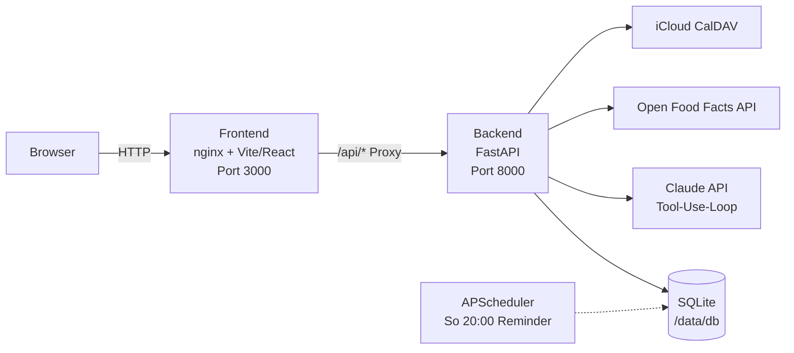

# Meal Planner

Selbst-gehosteter AI-Meal-Planning-Agent für den Raspberry Pi (ARM64).
Erstellt wöchentliche Mittag- und Abendessen-Pläne basierend auf
persönlichen Vorlieben und Fitness-Zielen — inklusive Makro-Tracking,
Einkaufsliste und Kalender-Export (`.ics` + optional CalDAV/Apple iCloud).

> Single-User, Single-Host: alles läuft auf einem Raspberry Pi im LAN, alle
> Daten bleiben lokal. Nährwerte kommen aus
> [Open Food Facts](https://world.openfoodfacts.org/).

## Architektur



## Stack

- **Backend:** Python 3.11 · FastAPI · SQLAlchemy · SQLite · Alembic · APScheduler
- **AI:** Anthropic Claude (`claude-opus-4-7` für Planung, `claude-haiku-4-5-20251001` für Sub-Tasks) mit Prompt-Caching und Multi-Turn-Tool-Use
- **Nährwerte:** Open Food Facts API mit lokalem SQLite-Cache
- **Kalender:** `icalendar` für ICS-Export, `caldav` für Apple-iCloud-Sync
- **Frontend:** React 18 · Vite · TailwindCSS · Recharts · React Router
- **Container:** Docker Compose (ARM64), persistente Volumes unter `./data/`

## Setup

### 1. Raspberry Pi vorbereiten (einmalig)

Auf dem Pi mit ARM64-OS (Raspberry Pi OS 64-bit oder Ubuntu Server):

```bash
# Docker + Compose installieren
curl -fsSL https://get.docker.com | sh
sudo usermod -aG docker $USER
# einmal aus- und wieder einloggen
```

### 2. Repo klonen + Konfiguration

```bash
git clone https://github.com/luckylucab0/meal-planner.git
cd meal-planner
cp .env.example .env
```

`.env` editieren:

| Variable | Beschreibung | Pflicht |
|---|---|---|
| `ANTHROPIC_API_KEY` | Von [console.anthropic.com](https://console.anthropic.com/) | ja |
| `ENCRYPTION_KEY` | Fernet-Key für CalDAV-Passwort | ja |
| `DATABASE_URL` | SQLite-Pfad im Container | nein |
| `LOG_LEVEL` | `INFO` / `DEBUG` / `WARNING` | nein |
| `OFF_USER_AGENT` | Open-Food-Facts-Policy-Header | nein |

`ENCRYPTION_KEY` generieren:

```bash
python3 -c "from cryptography.fernet import Fernet; print(Fernet.generate_key().decode())"
```

### 3. Basic-Auth-Passwort erzeugen

nginx schützt die gesamte App mit HTTP Basic Auth. Die Datei muss vor
dem ersten Build vorhanden sein:

```bash
# apache2-utils installieren (einmalig, auf dem Pi oder lokal)
sudo apt-get install -y apache2-utils

# .htpasswd mit bcrypt erzeugen (-B)
htpasswd -B -c frontend/nginx.htpasswd DEIN_USERNAME
# Passwort wird interaktiv abgefragt. Die Datei liegt lokal und ist via
# .gitignore vom Repo ausgeschlossen.
```

Alternativ mit Python (kein `htpasswd` nötig):

```bash
python3 -c "
import bcrypt, getpass
pw = getpass.getpass('Passwort: ').encode()
print('DEIN_USERNAME:' + bcrypt.hashpw(pw, bcrypt.gensalt(12)).decode())
" > frontend/nginx.htpasswd
```

> Das Backend ist **nicht** mehr direkt über Port 8000 erreichbar —
> alle Anfragen laufen ausschliesslich durch nginx (Port 3000).

### 4. Stack starten

```bash
# Daten-Verzeichnis mit korrekten Permissions anlegen (UID 1000 = appuser im Container)
mkdir -p data/db data/logs
chown -R 1000:1000 data/

docker compose up -d --build
```

- Frontend + Proxy auf `http://<pi-ip>:3000` (Basic-Auth erforderlich)
- Health-Check (ohne Auth): `curl http://<pi-ip>:3000/api/health` → `{"status":"ok"}`

Beim ersten Start läuft die Alembic-Migration automatisch — siehe
„Erst-Setup" weiter unten.

## Erst-Setup im Browser

1. **Vorlieben** (`/preferences`): Whitelist, Blacklist, Fitness-Ziel,
   Kalorien-/Protein-Ziel, max. Kochzeit, Diät-Tags. Speichern.
2. **Zutaten** (`/products`, optional): Eigene Lieblingsprodukte
   manuell anlegen oder via Open-Food-Facts-Knopf nachschlagen. Der
   Agent füllt die Bibliothek sonst automatisch beim ersten Plan.
3. **Plan generieren**: Auf dem Dashboard oder im Wochenplan
   „Neuen Plan generieren" → Anwesenheits-Grid Mo–So × Mittag/Abend
   ankreuzen → Notizen optional („Freitag Gäste") → Generieren.
   Der Agent läuft 30–60 Sekunden, abhängig von der Tiefe der
   OFF-Lookups.

## App-spezifisches Passwort für Apple-Kalender

Wenn du den Wochenplan automatisch in den iCloud-Kalender pushen willst:

1. Auf [account.apple.com](https://account.apple.com) anmelden.
2. *Anmeldung & Sicherheit* → *App-spezifische Passwörter* → „Generieren".
3. Name vergeben (z.B. „Meal Planner") → 16-stelliges Passwort kopieren.
4. Im Frontend unter *Einstellungen* eintragen + Sync aktivieren. Das
   Passwort wird Fernet-verschlüsselt in der DB gespeichert; der
   Klartext verlässt den Server nicht wieder.

## Backup

Die einzige State-Quelle ist `./data/db/meal_planner.db`. Sicheres
Backup-Skript für Cron auf dem Pi:

```bash
sqlite3 ./data/db/meal_planner.db ".backup ./data/db/meal_planner-$(date +%F).db"
```

## Troubleshooting

| Symptom | Ursache | Fix |
|---|---|---|
| `503 Service Unavailable` bei Plan-Generierung | `ANTHROPIC_API_KEY` fehlt | `.env` befüllen, `docker compose up -d` |
| `409 CalDAV ist nicht aktiviert` | Settings nicht gespeichert | Im Frontend unter *Einstellungen* aktivieren |
| `ENCRYPTION_KEY ist nicht gesetzt` | Fernet-Key fehlt | Key generieren (siehe Setup), in `.env` eintragen |
| Open-Food-Facts-Lookups schlagen fehl | OFF-Server träge oder Netzwerkproblem | Agent fällt automatisch auf Claude-Schätzung zurück (`upsert_product`) |
| `database is locked` | Mehrere Schreibvorgänge gleichzeitig | Bei Single-User selten — Container neustarten: `docker compose restart backend` |
| Frontend zeigt Stack-Trace nach Reload | Backend-Container hat sich neu gestartet, Vite-Dev-Mode | Im Production-Build (Default) tritt das nicht auf |

## Development

Backend lokal laufen lassen (Windows / macOS / Linux mit Python 3.11+):

```bash
cd backend
python -m venv .venv
.venv/Scripts/pip install -r requirements.txt    # Windows
# bzw.: source .venv/bin/activate && pip install -r requirements.txt

# Migration einmal anwenden
DATABASE_URL=sqlite:///./meal_planner.db alembic upgrade head

# Server starten
uvicorn app.main:app --reload --port 8000

# Tests
pytest -q
```

Frontend:

```bash
cd frontend
npm install
npm run dev    # Vite Dev-Server auf :5173, proxy zu :8000
```

Lint/Type-Check:

```bash
cd backend
ruff check .
mypy app
```

## API-Übersicht

```
GET    /api/health
GET    /api/preferences
PUT    /api/preferences
GET    /api/products?q=&category=&limit=&offset=
POST   /api/products
PUT    /api/products/{id}
DELETE /api/products/{id}
POST   /api/products/lookup        # lokal-first → OFF-Fallback
POST   /api/plans/generate
GET    /api/plans/current
GET    /api/plans/{id}
GET    /api/plans/history?limit=
DELETE /api/plans/{id}
POST   /api/plans/{id}/meals/{mid}/regenerate
GET    /api/shopping-list/{id}
GET    /api/shopping-list/{id}.txt
GET    /api/calendar/{id}.ics
POST   /api/calendar/sync-apple/{id}
GET    /api/stats/macros?from=&to=
GET    /api/settings
PUT    /api/settings
```

OpenAPI-Dokumentation läuft unter `http://<pi-ip>:8000/docs`.

## Lizenz / Status

Single-User-Hobby-Projekt. Kein Multi-User-Support, keine produktiven
Authentifizierungs-Flows. Wird im LAN hinter einer Firewall betrieben.

Copyright (C) 2026 [luckylucab0](https://github.com/luckylucab0) —
veröffentlicht unter der **GNU General Public License v3.0**.
Siehe [LICENSE](LICENSE) für den vollständigen Lizenztext.
Ableitungen müssen ebenfalls unter GPL v3 veröffentlicht werden und
den ursprünglichen Copyright-Vermerk beibehalten.
